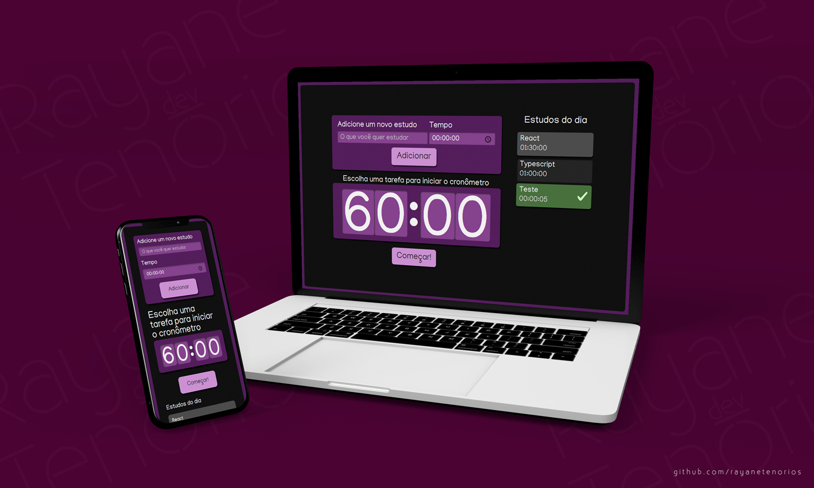

# Projeto: Cronômetro de atividades

Projeto "Alura-Studies", cronômetro de atividades, usando React com Typescript, do curso "**React: Escrevendo com Typescript", da [Alura](https://cursos.alura.com.br/course/react-modernizando-escrever-typescript)**.

 ### Como iniciar o projeto
 1. Clone o projeto pelo terminal:  
 ` git clone https://github.com/rayanetenorios/cronometro-de-atividades.git`
 #####
 2. Acesse a pasta do projeto:  
 ` cd cronometro-de-atividades `
 #####
3. Instale as dependências:  
` npm install `
#####
4. Finalmente, inicie o servidor local e aguarde:  
` npm start `
#
### Tecnologias
* [React](https://pt-br.reactjs.org/)
* [Typescript](https://www.typescriptlang.org/pt/)
* [SCSS](https://sass-lang.com/)
#
#### *Por: Rayane Mayara Tenório*
* [Linkedin](https://www.linkedin.com/in/rayanetenorios/)
#### *Mockup*
* [riandra](https://br.freepik.com/fotos-vetores-gratis/celular)
#
